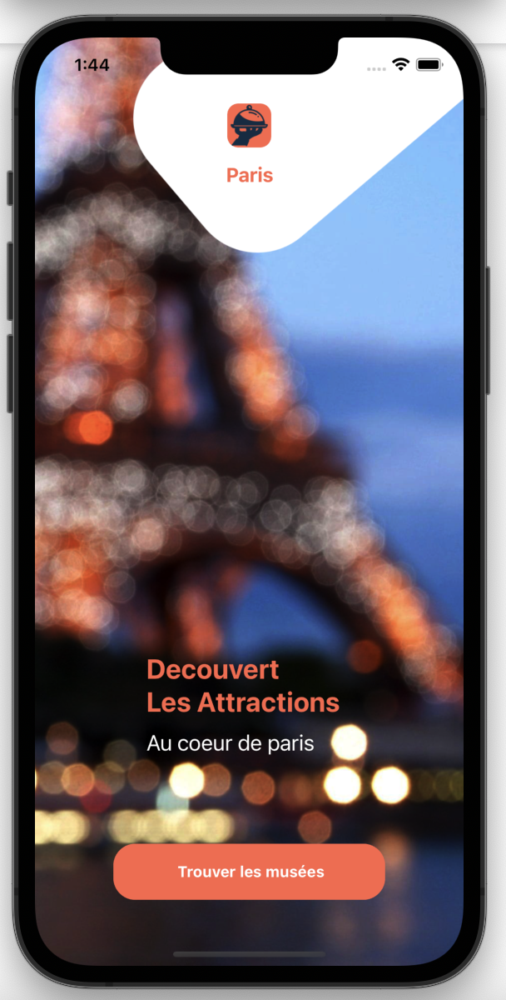
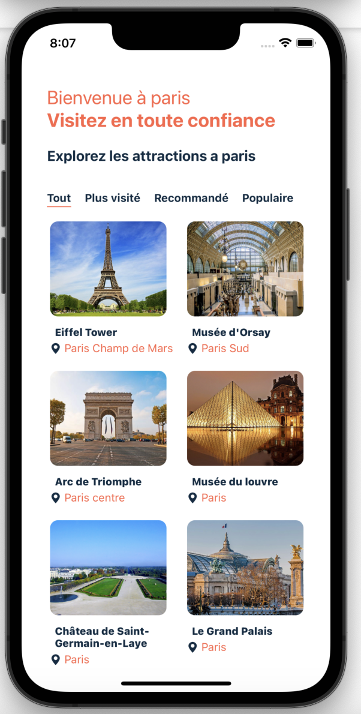
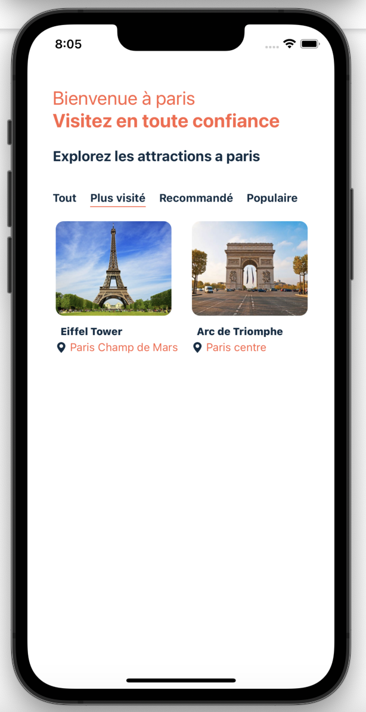
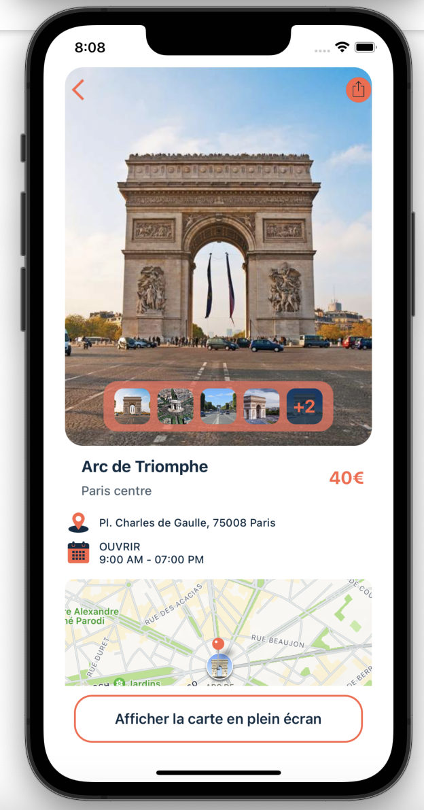
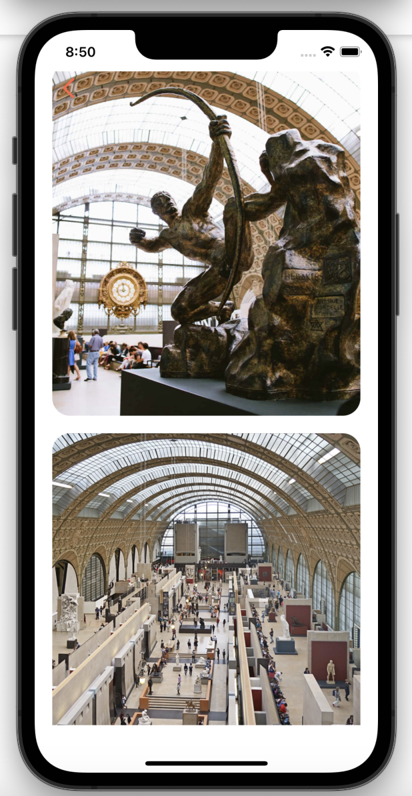
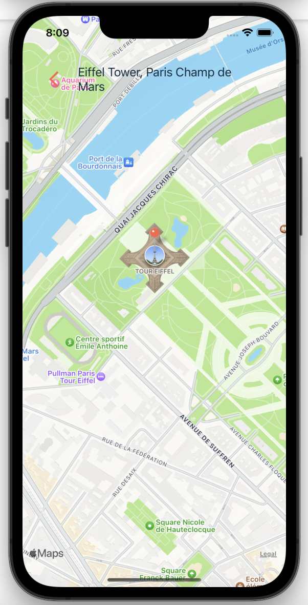

# ParisAttration 

### React Native full stack cross platform application ( ios and androide )
De Javascript et React Native pour le développement d'applications mobiles sur Android et iOS
React Hooks et React Context (useState, useEffect, useContext, useSelector, useDispatch, etc.)
Intégrez des bibliothèques natives, telles que Maps, Social Share, Firebase
- React Navigation, tels que les navigateurs Stack, Tabs et Drawer
### Screenshots
Page d'accueil  | Page attractions  | Page Catégories |
------------- | ------------- | ------------- 
  |  | 

Détails de l'attraction  | Galleries des attractions  | Map navigation |
------------- | ------------- | ------------- 
  |  | 
